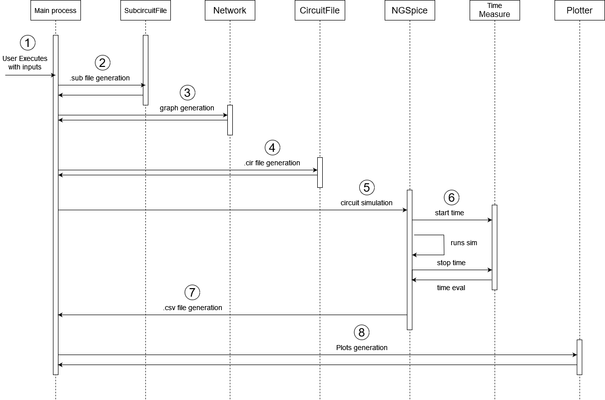

# Memristor Device Simulator

A web-based platform for simulating memristive circuits and networks. This application provides an intuitive interface for researchers, students, and engineers to configure, simulate, and analyze memristor behavior without requiring extensive programming knowledge.

## Table of Contents

- [What is a Memristor?](#what-is-a-memristor)
- [What This Application Does](#what-this-application-does)
- [Quick Start with Docker (Recommended)](#quick-start-with-docker-recommended)
  - [Step 1: Install Docker](#step-1-install-docker)
  - [Step 2: Get the Application](#step-2-get-the-application)
  - [Step 3: Start the Application](#step-3-start-the-application)
  - [Step 4: Access the Application](#step-4-access-the-application)
  - [Step 5: Stop the Application](#step-5-stop-the-application)
- [Project structure](#project-structure)
  - [Django Project Structure](#django-project-structure)
  - [Application-Specific Directories](#application-specific-directories)
  - [Root Level Files](#root-level-files)
- [Alternative: Manual Installation](#alternative-manual-installation)
- [Web Interface Usage](#web-interface-usage)
  - [Simulation Results](#simulation-results)

---

## What is a Memristor?
A memristor is a passive electronic component that changes its resistance based on the history of current that has flowed through it. This "memory resistance" makes memristors valuable for neuromorphic computing, non-volatile memory, and analog computation applications.

## What This Application Does
- **Circuit Simulation**: Generate and simulate memristive circuits using industry-standard NGSpice
- **Multiple Models**: Support for Pershin and Vourkas memristor models
- **Network Analysis**: Simulate individual devices or complex networks
- **Visualization**: Automatic generation of I-V curves, hysteresis loops, and time-domain plots
- **Export Results**: Download simulation data and plots as organized ZIP files

---

## Quick Start with Docker (Recommended)

Docker provides the easiest way to run the application across all operating systems. No need to install Python, NGSpice, or manage dependencies manually.

### Step 1: Install Docker

#### Windows
1. Download [Docker Desktop for Windows](https://docs.docker.com/desktop/install/windows/)
2. Follow the installation wizard
3. Restart your computer when prompted
4. Open Docker Desktop and wait for it to start

#### macOS
1. Download [Docker Desktop for Mac](https://docs.docker.com/desktop/install/mac-install/)
2. Drag Docker.app to Applications folder
3. Launch Docker from Applications
4. Complete the setup process

#### Linux (Ubuntu/Debian)
```bash
# Update package index
sudo apt-get update

# Install Docker
sudo apt-get install docker.io docker-compose

# Add your user to docker group (optional, avoids using sudo)
sudo usermod -aG docker $USER
# Log out and back in for this to take effect
```

#### Linux (Other Distributions)
Follow the [official Docker installation guide](https://docs.docker.com/engine/install/) for your specific distribution.

### Step 2: Get the Application

#### Option A: Download ZIP (No Git Required)
1. Go to the [repository page](https://github.com/ignaciopineyro/memristor_simulation)
2. Click the green "Code" button
3. Select "Download ZIP"
4. Extract the ZIP file to your desired location
5. Open terminal/command prompt in the extracted folder

#### Option B: Clone with Git
```bash
git clone https://github.com/ignaciopineyro/memristor_simulation.git
cd memristor_simulation
```

### Step 3: Start the Application

#### Windows (Command Prompt or PowerShell)
```bash
# First time setup
docker-compose up --build

# Subsequent runs
docker-compose up
```

#### macOS/Linux (Terminal)
```bash
# If you have make installed (recommended)
make up-build    # First time
make up          # Subsequent runs

# Without make
docker-compose up --build    # First time
docker-compose up           # Subsequent runs
```

### Step 4: Access the Application

Once you see "Starting development server at http://0.0.0.0:8000/" in the terminal:

1. **Open your web browser**
2. **Navigate to**: http://localhost:8000
3. **Start simulating!**

### Step 5: Stop the Application

- **Press `Ctrl+C`** in the terminal, or
- **Run**: `docker-compose down` (or `make down`)

---

## Project structure:

This is a Django web application that follows the standard Django project structure with additional organization for memristor simulation functionality. The project is organized as follows:

### Django Project Structure

- **`djangoproject/`**: Main Django project directory containing configuration files
    * `settings.py`: Django configuration including database, static files, and app settings
    * `urls.py`: URL routing configuration
    * `wsgi.py` & `asgi.py`: WSGI and ASGI application entry points

- **`memristorsimulation_app/`**: Main Django application containing all simulation functionality
    * `models.py`: Django ORM models for data persistence
    * `views.py`: Django views handling HTTP requests and responses
    * `admin.py`: Django admin interface configuration
    * `apps.py`: Application configuration
    * `constants.py`: Enum objects with constants used throughout the project
    * `representations.py`: Dataclasses representations used in the project

### Application-Specific Directories



- **`memristorsimulation_app/services/`**: Business logic services for simulation operations
    * `circuitfileservice.py`: Circuit file (.cir) generation with subcircuits dependencies, component instances, analysis commands and control commands
    * `subcircuitfileservice.py`: Subcircuit file (.sub) generation containing memristor model parameters, dependencies, sources, and components
    * `plotterservice.py`: Plotting service for I-V and State-Time curves, comparative plots between simulations, and sub-plot figures
    * `directoriesmanagementservice.py`: Path resolution and folder creation utilities
    * `ngspiceservice.py`: NGSpice simulation wrapper with time measurement capabilities
    * `timemeasureservice.py`: Simulation time measurement logic
    * `networkservice.py`: Network topology generation for multi-device simulations

- **`memristorsimulation_app/models/`**: Memristor model definitions
    * `pershin.sub`: Pershin memristor model subcircuit file
    * `vourkas.sub`: Vourkas memristor model subcircuit file

- **`memristorsimulation_app/templates/`**: Django HTML templates for web interface
    * Simulation parameter input forms
    * Component-based modular templates for different simulation types

- **`memristorsimulation_app/static/`**: Static web assets
    * CSS stylesheets for form styling and responsive design
    * JavaScript modules for form validation and interaction

- **`memristorsimulation_app/serializers/`**: Django REST Framework serializers
    * Data serialization for API endpoints and form validation

- **`memristorsimulation_app/tests/`**: Test suite
    * Unit tests for services, models, and API endpoints
    * Integration tests for simulation workflows

- **`memristorsimulation_app/simulation_results/`**: Simulation output storage
    * `pershin_simulations/`: Results from Pershin model simulations
    * `vourkas_simulations/`: Results from Vourkas model simulations
    * Each simulation creates subdirectories containing:
        * CSV data files with simulation results
        * Generated plots in various formats
        * Simulation logs with NGSpice output and time measurements

### Root Level Files

- **`manage.py`**: Django management script for running commands
- **`requirements.txt`**: Python dependencies needed to run the application
- **`db.sqlite3`**: SQLite database file (created after first migration)
- **`Dockerfile`**: Docker container configuration
- **`docker-compose.yml`**: Docker Compose orchestration file
- **`entrypoint.sh`**: Docker container startup script

---

## Alternative: Manual Installation

For advanced users who prefer not to use Docker, we provide detailed manual installation instructions in a separate guide:

**[Manual Installation Guide](MANUAL_INSTALLATION.md)**

**Note**: Manual installation is more complex and requires troubleshooting skills. We strongly recommend using Docker for most users.

---

## Web Interface Usage

The Django web interface provides an easy-to-use form for configuring and running memristor simulations:

1. **Model Configuration:** Select memristor model (Pershin or Vourkas). Parameters will depend on the chosen model (Pershin and Vourkas have the same set of params)
2. **Input Parameters:** Source name and connection nodes
3. **Waveform Configuration:** Configure voltage waveforms (SIN, PULSE, PWL)
4. **Simulation Parameters:** Set simulation type, time steps, voltages, and device parameters
5. **Export Parameters:** Folder and file name and magnitudes to export
6. **Network Configuration:** Choose between single device or network topology. Parameters will depend on the chosen network type
7. **Plotter:** Select plot types. Some plots will depend on the chosen network type
8. **Execute Simulation:** Click "Run Simulation" to execute and download results as ZIP

### Simulation Results
- Simulation execution time scales with complexity of the circuit (amount of devices)
- Results are automatically packaged as ZIP files
- Include CSV data files, generated plots, and simulation logs
- Persistent storage maintains simulation history

---
---

#### Coded by Ignacio Piñeyro as part of my Electronic Eng. degree's final project for Universidad Nacional de San Martin (UNSAM). Feel free to send any questions, suggestions or comments to ignaciopineyroo@gmail.com
